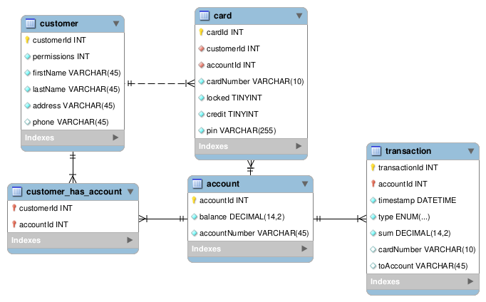

# group15 - ATM Project

## database
Contains SQL script for creating the bankdb database layout.  
Also contains a script to add test data into the database.

### The database layout

## atm-api
NodeJS REST API backend for authentication/account management.

## atm-dll
Contains DLL/Shared libraries used by `atm-ui` for different tasks.  
Refer to `atm-dll/README.md` for information about each component.

## atm-ui
Allows the user to widthdraw/view their balance  
Uses DLLs/Shared libraries in `atm-dll` to acomplish vital application specific functions.
